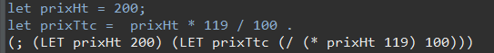
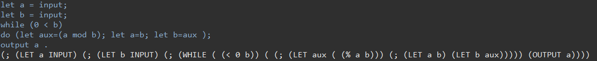
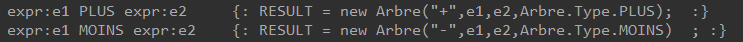

# TP Compilation : Génération d'arbres abstraits
Binôme : LOMBARDI Alexis - CARRILLO Killian
## TP 2 - Génération d'arbres 

Pour la génération d'arbres, nous avons d'abord créer une classe Arbre avec comme attributs :
String racine;
Arbre arbreG;
Arbre arbreD;
Type type; (lié à une énumération de tout ce qui vient du .cup)
Ensuite, pour son affichage, nous avons changé le toString pour correspondre visuellement à l'arbre
```
public String toString() {
		if(getArbreG()==null && getArbreD()==null) {
			return racine;
		}
		else if(getArbreG()==null) {
			return "("+ racine +" "+getArbreD().toString() +")";
		}
		else if(getArbreD()==null) {
			return "("+ racine +" "+getArbreG().toString() +")";
		}
		if (racine!=null) {
			return "("+racine +" "+getArbreG().toString()+" "+getArbreD().toString() +")";
		}
		return "";
```

Ainsi :


nous donne bien 


Le deuxième exemple 
```
let a = input;
let b = input;
while (0 < b)
do (let aux=(a mod b); let a=b; let b=aux );
output a .
```
donnera bien 


Pour obtenir, ces résultats sont obtenus en créant dans le .cup les arbres au fur et à mesure comme ceci



## TP3-4 TP Compilation : Génération de code pour un sous ensemble du langage λ-ada.

À partir de l'arbre abstrait construit lors du dernier TP, avec les outils JFlex et CUP, l'objectif consiste à générer du code pour la machine à registres décrite dans le cours, afin d'être en mesure d'exécuter les programmes reconnus par l'analyseur sur la machine à registres.
Pour ce faire, on a modifier la classe Arbre.java en lui ajoutant différentes fonctions.*
Cette convertion sera afiché dans la console, mais également écrit dans un fichier pgcd.asm.

## Exercice 1 :

Dans la première partie du tp on a essayer de convertir l'expression suivante:

```
let prixHt = 200;
let prixTtc =  prixHt * 119 / 100;
output prixTtc
.
```
Grâce au TP2 on a obtenu le resultat suivant:

```
(; (LET prixHt 200) (; (LET prixTtc (/ (* prixHt 119) 100)) (OUTPUT prixTtc)))
```
On a du faire la convertion pour le "let", "*", "/", ";" et "output".
Grâce a notre convertion, on obtient :
```
SEGMENT
	prixHt DD
	prixTtc DD
DATA ENDS
CODE SEGMENT
	mov eax, 200
	mov prixHt, eax
	mov eax, prixHt
	push eax
	mov eax, 119
	pop ebx
	mul eax, ebx
	push eax
	mov eax, 100
	pop ebx
	div ebx, eax
	mov eax, ebx
	push eax
	mov prixTtc, eax
	mov eax, prixTtc
	push eax
	mov eax,prixTtc
	out eax
CODE ENDS
```
Puis on a essayé le code sur l'émulateur fournis par le professeur.
```
C:\Users\baub\Desktop\805\I805_TP2_Lambada>java -jar ./vm-0.9.jar ./pgcd.asm
>>>>238
>>>>>>>>>>>>>>>>>>>>>> That's all
```
Le code fonctionne, on obtient bien 238.

## Exercice 2 :


Dans la deuxième partie du tp on a essayer de convertir l'expression suivante:

```
let a = input;
let b = input;
while (0 < b)
do (let aux=(a mod b); let a=b; let b=aux );
output a
.
```
Grâce au TP2 on a obtenu le resultat suivant:

```
(; (LET a INPUT) (; (LET b INPUT) (; (WHILE ( (< 0 b)) ( (; (LET aux ( (% a b))) (; (LET a b) (LET b aux))))) (OUTPUT a))))
```
On a du ajouter à la convertion pour le "while" et gérer 3 variables différentes.
Grâce a notre convertion, on obtient :
```
DATA SEGMENT
	a DD
	b DD
	aux DD
DATA ENDS
CODE SEGMENT
	in eax
	mov a, eax
	in eax
	mov b, eax
debut_while_1:
	mov eax, 0
	push eax
	mov eax, b
	pop ebx
	sub eax,ebx
	jle faux_gt_1
	mov eax,1
	jmp sortie_gt_1
faux_gt_1:
	mov eax,0
sortie_gt_1:
	jz sortie_while_1
	mov eax, b
	push eax
	mov eax, a
	pop ebx
	mov ecx,eax
	div ecx,ebx
	mul ecx,ebx
	sub eax,ecx
	mov aux, eax
	mov eax, b
	mov a, eax
	mov eax, aux
	mov b, eax
	jmp debut_while_1
sortie_while_1:
	mov eax,a
	out eax
CODE ENDS
```
Puis on a essayé le code sur l'émulateur fournis par le professeur.
```
C:\Users\baub\Desktop\805\I805_TP2_Lambada>java -jar ./vm-0.9.jar ./pgcd.asm
>221
>782
>>>>17
>>>>>>>>>>>>>>>>>>>>>> That's all
```
Le code fonctionne, on obtient bien 17.